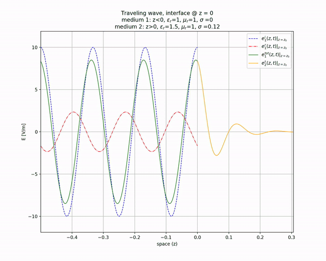
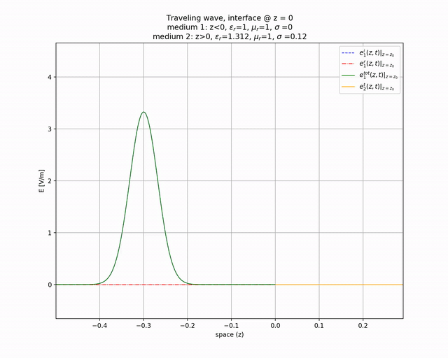

Simulation of electric field wave @ interface with a different medium

### Running

(Python3.7 required)

```sh
pipenv shell
pipenv sync
python traveling_wave_1.py
```

example:

```sh
python3.7 traveling_wave_1.py
Insert f [Hz]: (or enter to use default value 1.8e+09) 2e9
Insert E_0 [V]: (or enter to use default value 10)
Using default: E_0 = 10
Insert ε_r_1: (or enter to use default value 1)
Using default: ε_r_1 = 1
Insert μ_r_1: (or enter to use default value 1)
Using default: μ_r_1 = 1
Insert σ_1: (or enter to use default value 0)
Using default: σ_1 = 0
Insert ε_r_2: (or enter to use default value 1.5)
Using default: ε_r_2 = 1.5
Insert μ_r_2: (or enter to use default value 1)
Using default: μ_r_2 = 1
Insert σ_2: (or enter to use default value 0.12) 0.111231
Insert wave: cosine / gaussian pulse ([c]/g)?

********************
σ_2/(ω*ε_0*ε_r_2) = 0.6665  ==> medium 2 is a(n) Dielectric
μ_eq_1 = 1.257e-06
μ_eq_2 = 1.257e-06
ε_eq_1 = 8.854e-12+0j
ε_eq_2 = 1.328e-11-8.851e-12j
ζ_1 = 376.7+0j
ζ_2 = ζ_0·(0.7129+0.2158j) = 268.6+81.29j
k_1 = 41.92+0j
k_2 = 53.86-16.3j
Γ_e = 0.208 ∠ 2.372
τ_e = 0.8628 ∠ 0.1686
δ = 0.06133
λ_1 = 0.1499
v_1 = 2.998e+08
S_i = 0.1327+0j
S_t = 0.127+0j = 95.67+0j% S_i
Want to plot? ([y]/n)?
Want to save plot animation? (y/[n])? y
```

```sh
$ python3.7 traveling_wave_1.py
Insert f [Hz]: (or enter to use default value 1.8e+09)
Using default: f = 1.8e+09
Insert E_0 [V]: (or enter to use default value 10)
Using default: E_0 = 10
Insert ε_r_1: (or enter to use default value 1)
Using default: ε_r_1 = 1
Insert μ_r_1: (or enter to use default value 1)
Using default: μ_r_1 = 1
Insert σ_1: (or enter to use default value 0)
Using default: σ_1 = 0
Insert ε_r_2: (or enter to use default value 1.5) 1.312
Insert μ_r_2: (or enter to use default value 1)
Using default: μ_r_2 = 1
Insert σ_2: (or enter to use default value 0.12)
Using default: σ_2 = 0.12
Insert wave: cosine / gaussian pulse ([c]/g)? g

********************
σ_2/(ω*ε_0*ε_r_2) = 0.9134  ==> medium 2 is a(n) Dielectric
μ_eq_1 = 1.257e-06
μ_eq_2 = 1.257e-06
ε_eq_1 = 8.854e-12+0j
ε_eq_2 = 1.162e-11-1.061e-11j
ζ_1 = 376.7+0j
ζ_2 = ζ_0·(0.6994+0.2713j) = 263.5+102.2j
k_1 = 37.73+0j
k_2 = 46.88-18.19j
Γ_e = 0.2353 ∠ 2.249
τ_e = 0.8718 ∠ 0.2117
δ = 0.05498
λ_1 = 0.1666
v_1 = 2.998e+08
S_i = 0.1327+0j
S_t = 0.1254+0j = 94.46+0j% S_i
Want to plot? ([y]/n)?
Want to save plot animation? (y/[n])? y
```






