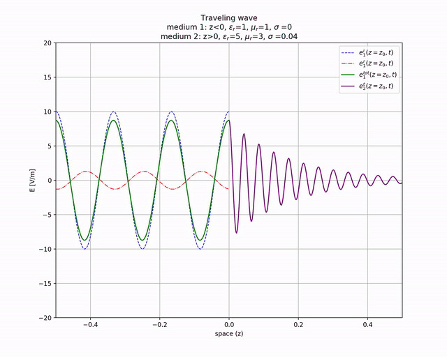
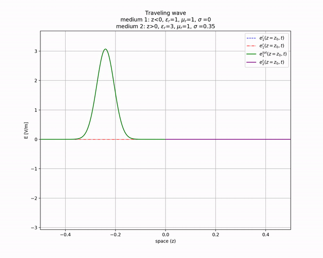
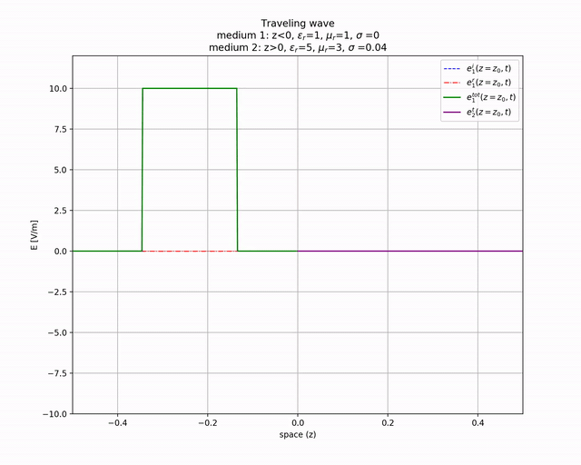

Simulation of electric field wave @ interface with a different medium









### Running

(Python3.7 required)

```sh
pipenv shell
pipenv sync
python wave.py
```

example:

```sh
$ python wave.py

Insert f [Hz]: (or enter to use default value 1.8e+09) 2e9
Insert E_0 [V]: (or enter to use default value 10) 8
Insert ε_r_1: (or enter to use default value 1)
Using default: ε_r_1 = 1
Insert μ_r_1: (or enter to use default value 1)
Using default: μ_r_1 = 1
Insert σ_1: (or enter to use default value 0)
Using default: σ_1 = 0
Insert ε_r_2: (or enter to use default value 1.5) 1.54
Insert μ_r_2: (or enter to use default value 1)
Using default: μ_r_2 = 1
Insert σ_2: (or enter to use default value 0.12) 0.16
Insert wave: cosine / gaussian / rectangular pulse ([c]/g/r)?

********************

σ_2/(ω*ε_0*ε_r_2) = 0.9338  ==> medium 2 is a(n) Dielectric
μ_eq_1 = 1.257e-06
μ_eq_2 = 1.257e-06
ε_eq_1 = 8.854e-12+0j
ε_eq_2 = 1.364e-11-1.273e-11j
ζ_1 = 376.7+0j
ζ_2 = ζ_0·(0.6409+0.2527j) = 241.4+95.2j
k_1 = 41.92+0j
k_2 = 56.6-22.32j
Γ_e = -0.1906+0.1834j = 0.2645 ∠ 2.376
τ_e = 0.8094+0.1834j = 0.8299 ∠ 0.2228
δ = 0.04481
λ_1 = 0.1499
v_1 = 2.998e+08
S_i = 0.08494+0j
S_t = 0.079+0j = 93+0j% S_i
Want to plot? ([y]/n)?
Want to save plot animation? (y/[n])? y
```

