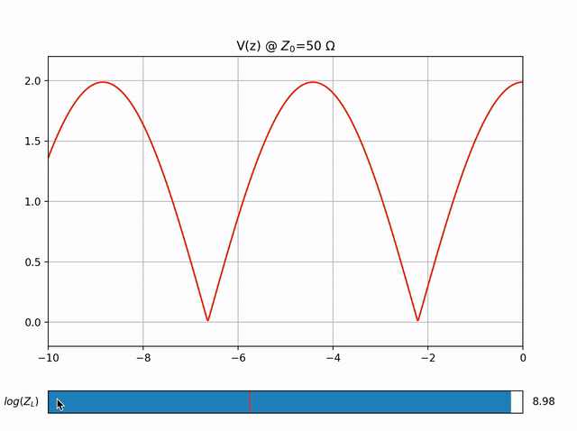

Simulation of the voltage across a 50 Ω trasmission line as a function of space w/ parametric load.

The slider sets the load, on a logaritmic scale from short circuit to open circuit (10-3 to 103 Ω)

